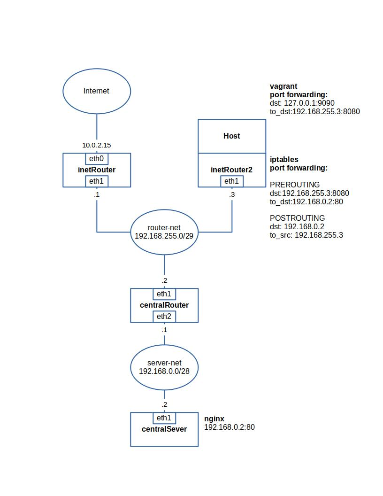

# Домашнее задание 20. Сценарии iptables
- реализовать knocking port
- centralRouter может попасть на ssh inetrRouter через knock скрипт пример в материалах.
- добавить inetRouter2, который виден(маршрутизируется (host-only тип сети для виртуалки)) с хоста или форвардится порт через локалхост.
- запустить nginx на centralServer.
- пробросить 80й порт на inetRouter2 8080.
- дефолт в инет оставить через inetRouter. Формат сдачи ДЗ - vagrant + ansible
- реализовать проход на 80й порт без маскарадинга

## Выполнение
Развернута сеть, представленная на изображении:


- Запуск стенда 
```
git clone 
```
```
vagrant up
```
- Проверка knocking port
```
vagrant ssh centralRouter
```
Убедиться, что сначала inetRouter не доступен по ssh:
```
ssh vagrant@192.168.255.1
```
Провести knocking port:
```
./knock.sh 192.168.255.1 8881 7777 9991
```
Проверить доступность inetRouter по ssh:
```
ssh vagrant@192.168.255.1
```
- Проверка доступности web-сервера на centralServer
На хосте в браузере ввести адрес `http://127.0.0.1:9090`. Убедиться что сервис доступен.
Проброс порта 9090 на 8080 выполняется на хосте (см. `Vagrantfile`).
```
box.vm.network "forwarded_port", guest: 8080, guest_ip: "192.168.255.3", host: 9090, host_ip: "127.0.0.1",  protocol: "tcp"
```
NAT выполняется на inetRouter2 (см. `provisioning/templates/iptables.inetRouter2`).
```
-A PREROUTING -i eth0 -p tcp -m tcp --dport 8080 -j DNAT --to-destination 192.168.0.2:80
-A POSTROUTING -d 192.168.0.2/32 -j SNAT --to-source 192.168.255.3
```